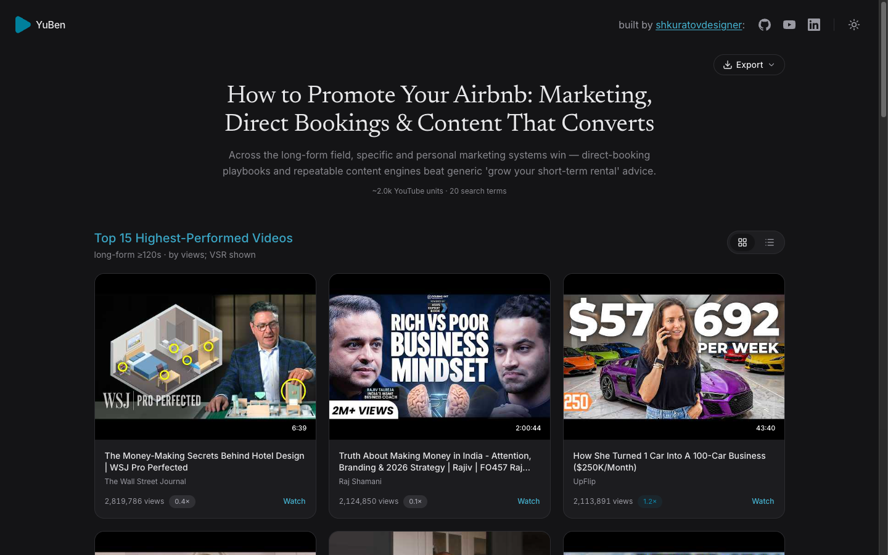
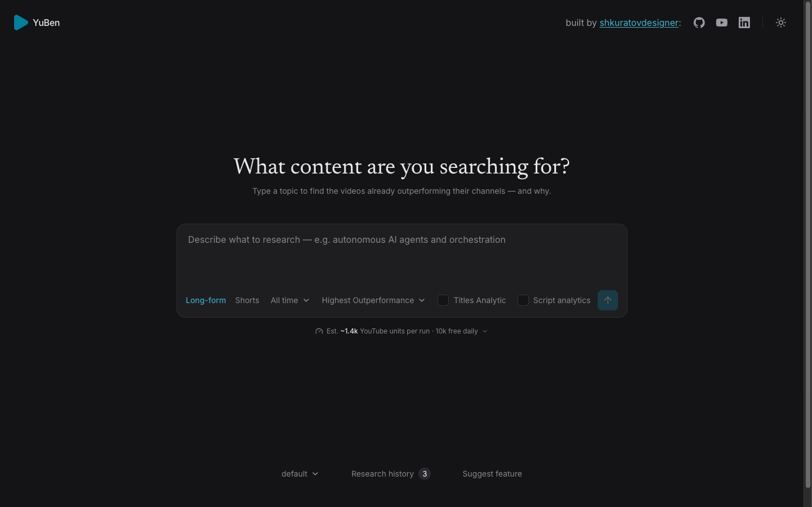
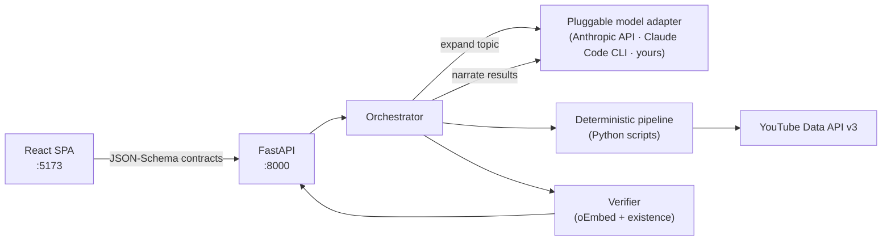

<div align="center">

<picture>
  <source media="(prefers-color-scheme: dark)" srcset="docs/assets/logo-dark.svg">
  
</picture>

### Find the YouTube videos that massively outperform their channels — and learn exactly why.

[](LICENSE)
[](#development)
[](backend/pyproject.toml)
[](frontend/package.json)
[](backend/app/main.py)
[](#your-keys-stay-on-your-machine)



</div>

---

**YuBen** is a local-first web app for YouTube content research. Type a topic and it finds *outlier* videos — ones that earn far more views than their channel's subscriber count predicts — then explains what makes them win: a ranked watch list, title-pattern analysis, and a concrete game plan for your own video.

The core signal is **VSR (views ÷ subscribers)**. A million views on a 24k-subscriber channel (41×) tells you the *idea* carried the video, not the audience. Those are the videos worth studying.

## How it works

<div align="center">

</div>

1. **Describe a topic** and pick your filters — long-form or Shorts, upload window, outperformance tier (any / 2× / 5× / highest).
2. **The pipeline researches deterministically.** An LLM agent expands your topic into ~20 search terms, then Python scripts query the YouTube Data API, compute VSR and engagement, filter out promoted/dead-engagement videos, and rank the outliers.
3. **The agent narrates, the backend verifies.** The LLM writes the summary, watch-list reasoning, and title/script analysis — but every video ID, view count, and link is re-checked against the script output and YouTube oEmbed before it renders.

> **The trust rule (non-negotiable):** all numbers and video IDs come from the deterministic pipeline JSON and are re-verified by the backend. The LLM supplies *narrative only* — the app never renders a video ID the model typed. LLMs are great at prose and terrible at not inventing plausible-looking YouTube links; YuBen is built around that fact. See [docs/PRD.md](docs/PRD.md) §8.

## Features

- **Outlier discovery** — VSR-ranked results with engagement sanity checks (likes-per-1k-views flags bought/promoted views).
- **Recommended watch list** — a short, sequenced list of what to watch and what to take from each video.
- **Title & script analysis** — common patterns, emotional triggers, and hook structures across the outlier set, with per-video transcripts when enabled.
- **Bring your own model** — the LLM sits behind a small pluggable adapter interface, not a hardcoded vendor. Two adapters ship working today (Anthropic API key, Claude Code CLI), a Gemini CLI adapter is stubbed, and adding your own — Codex CLI, OpenAI API, a local model — is one small class. See [Model adapters](#model-adapters).
- **Quota-aware** — shows the estimated YouTube API units before each run (~1.4k of the free 10k daily).
- **Research history & export** — every run is stored locally (SQLite) and exportable.
- **Mock-first UI** — the entire interface runs on bundled fixtures with no backend and no keys, so you can explore it in one command.
- **Dark & light mode**, responsive, keyboard-accessible.

## Quickstart

```bash
git clone https://github.com/shkuratovdesigner/yuben-app.git
cd yuben-app
make install     # backend venv + frontend node deps
make dev         # backend :8000 + frontend :5173 — UI in mock mode
```

Then open `http://localhost:5173` in your browser — the app runs entirely on your own machine (nothing is hosted). In mock mode that's the full UI on bundled fixtures, no API keys needed.

For **live research**, run `make dev-live` and connect two things in the app's onboarding flow:

| What | Used for | Where to get it |
|---|---|---|
| YouTube Data API v3 key | search + video/channel stats | [Google Cloud Console](https://console.cloud.google.com/) → enable *YouTube Data API v3* → create an API key |
| An LLM, via any [model adapter](#model-adapters) | topic expansion + narrative analysis | e.g. an [Anthropic API key](https://console.anthropic.com/) or a CLI agent you already have installed |

### Your keys stay on your machine

- Everything runs locally — there is no hosted service and no telemetry.
- Keys are stored in your **OS keychain** (via `keyring`), never in the repo or a dotfile, and the store is **write-only** toward the UI: the frontend can set or test a key but can never read it back.
- Each key is only ever sent to its own provider's API — the YouTube key to `googleapis.com`, a model key to that model provider (e.g. `api.anthropic.com`).

## Model adapters

YuBen doesn't care which LLM writes the narrative — the model sits behind one small interface ([`backend/app/adapters/base.py`](backend/app/adapters/base.py)): `detect()`, `models()`, `check_env()`, `stream()`.

| Adapter | How it connects | Status |
|---|---|---|
| **Anthropic API** | paste an API key in the UI — no terminal needed | ✅ working |
| **Claude Code CLI** | uses the local CLI you already have | ✅ working |
| **Gemini CLI** | local CLI | 🧩 stubbed — interface wired, run surface unfinished |
| Codex CLI · OpenAI API · local models | your pick | 🗺️ planned — **adapter PRs very welcome** |

To add one: implement the interface for your CLI or API of choice, register it in [`backend/app/adapters/__init__.py`](backend/app/adapters/__init__.py), and the UI picks it up automatically via `GET /api/adapters`. Whatever the adapter, the [trust rule](#how-it-works) holds — the model only ever contributes narrative, never data.

## Architecture



The frontend and backend never share hand-written types: every payload crossing the wire is defined once in [`contracts/schemas/`](contracts/schemas) (JSON Schema) and generated into TypeScript types and Pydantic models, validated against committed fixtures on both sides.

```
yuben-app/
├── frontend/     Vite + React 19 + TypeScript + Tailwind v4 + shadcn/ui
├── backend/      FastAPI — api/ adapters/ orchestrator/ pipeline/ verify/ store/
├── contracts/    JSON Schemas → generated TS + Pydantic, fixtures, build_fixtures.py
├── docs/         PRD.md · CONTRACTS.md · BUILD_PLAN.md
└── *.py          Deterministic research scripts (YouTube search, VSR, transcripts)
```

## Development

```bash
make test        # backend pytest + frontend typecheck
make build       # production frontend build
make help        # everything else
```

The backend test suite runs with **no network and no keys** — the YouTube client and LLM adapters are mocked, and pipeline behavior is verified against the committed contract fixtures. A handful of raw-data parity tests skip unless local `data/*.json` pipeline output is present.

Design and behavior are specified in [docs/PRD.md](docs/PRD.md); the wire format lives in [docs/CONTRACTS.md](docs/CONTRACTS.md); the phased build history is in [docs/BUILD_PLAN.md](docs/BUILD_PLAN.md).

## License

[MIT](LICENSE) © [shkuratovdesigner](https://github.com/shkuratovdesigner)
